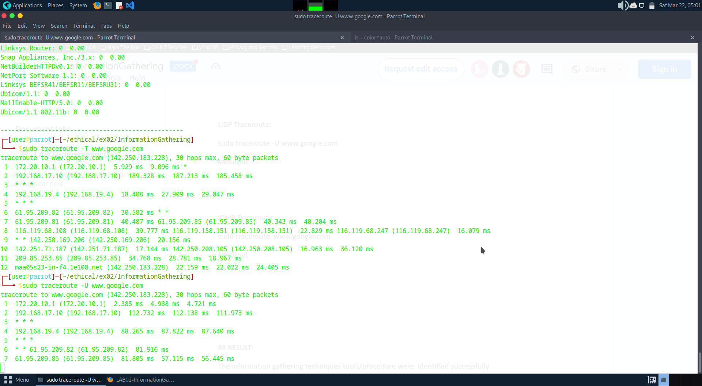
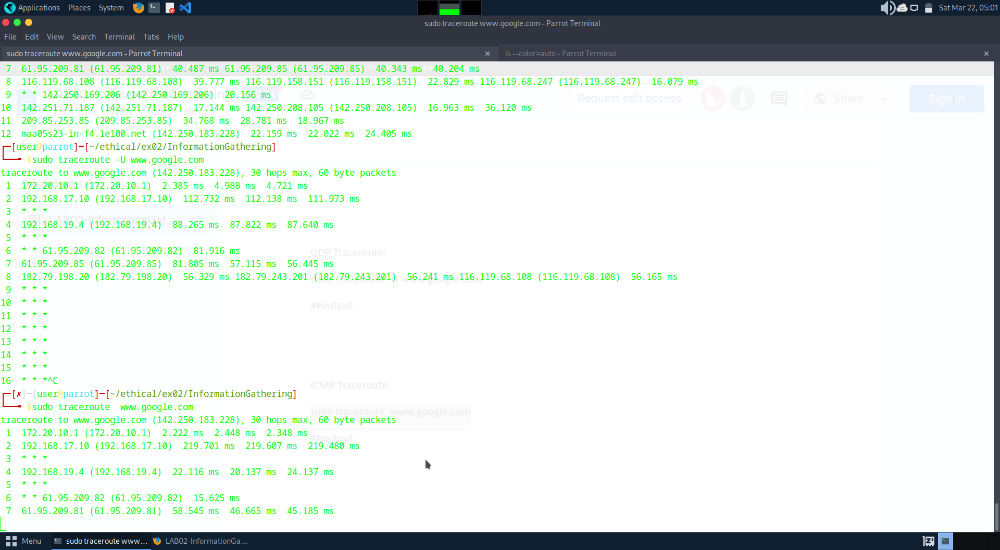

# InformationGathering
Information Gathering Techiques

# To perform information gathering techniques

# AIM:

To perform information gathering techniques using kali linux 

## STEPS:

### Step 1:

Install kali linux either in partition or virtual box or in live mode

### Step 2:

Investigate on the various categories of tools as follows:

### Step 3:
Open terminal/browser and try execute necessary commands/use url to perform information gathering


## OUTPUT:

### whois.com


### ping in parrot os example ping facebook.com


### i2ploaction.com


### https://web.archive.org/ history of the website


### NETCAT :

```
sudo nc example.com 80
GET / HTTP/1.1
Host: example.com

```


### nmap


### whatweb


### whatweb to connect metasploitable


### httprint


### Tracing the Location

# sudo traceroute -T www.google.com



# UDP :

# sudo traceroute -U www.google.com



### ICMP Traceroute:
sudo traceroute  www.google.com


## RESULT:
The information gathering techniques tools/procedure were  identified successfully
